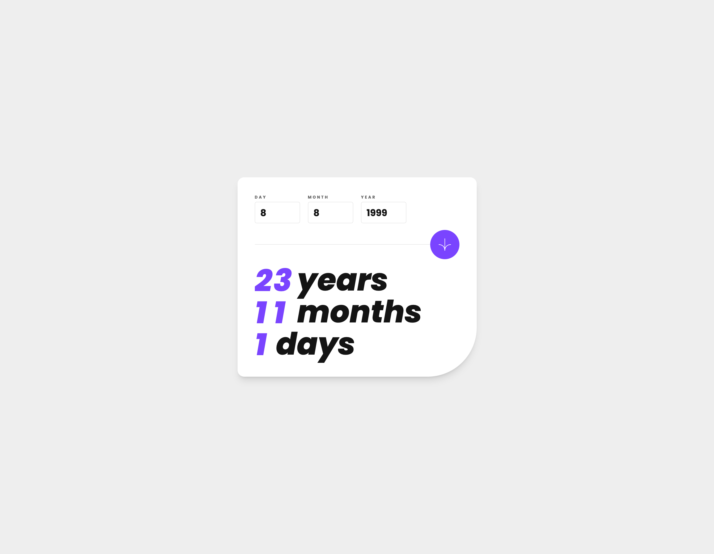

# Frontend Mentor - Age calculator app solution

This is a solution to the [Age calculator app challenge on Frontend Mentor](https://www.frontendmentor.io/challenges/age-calculator-app-dF9DFFpj-Q). Frontend Mentor challenges help you improve your coding skills by building realistic projects.

## Table of contents

- [Overview](#overview)
  - [The challenge](#the-challenge)
  - [Screenshot](#screenshot)
  - [Links](#links)
- [My process](#my-process)
  - [Built with](#built-with)
  - [What I learned](#what-i-learned)
- [Author](#author)

## Overview

### The challenge

Users should be able to:

- View an age in years, months, and days after submitting a valid date through the form ✅
- Receive validation errors if:
  - Any field is empty when the form is submitted ✅
  - The day number is not between 1-31 ✅
  - The month number is not between 1-12 ✅
  - The year is in the future ✅
  - The date is invalid e.g. 31/04/1991 (there are 30 days in April) ✅
- View the optimal layout for the interface depending on their device's screen size ✅
- See hover and focus states for all interactive elements on the page ✅
- **Bonus**: See the age numbers animate to their final number when the form is submitted ✅

### Screenshot

### Links

- Solution URL: [Add solution URL here](https://ditwanp.github.io/AgeCalculatorFM/)
- Live Site URL: [Add live site URL here](https://ditwanp.github.io/AgeCalculatorFM/)

## My process

Identify core functionality, pieces of the desing that can be broken into smaller components. Implement the base styling first so that I could focus on the functionality after. Added the actual age calculating functionality, then added validation on top that. Go back and tweak styling to accomodate the now functional error states.

### Built with

- [Vite](https://vitejs.dev/) - Frontend project scaffolding.
- [React.js](https://reactjs.org/) - JavaScript Library.
- [TypeScript](https://www.typescriptlang.org/) - Strongly typed JavaScript.
- [Tailwind CSS](https://styled-components.com/) - For styling.
- [Moment.js](https://momentjs.com/) - Made age calculation relatively simple.

### What I learned

This project was mainly for the purpose of introducing me to a few tools that I have been wanting to try out. Specifically Vite, and Tailwind.

## Author

- Website - [Ditwan Price](https://www.ditwanprice.com)
